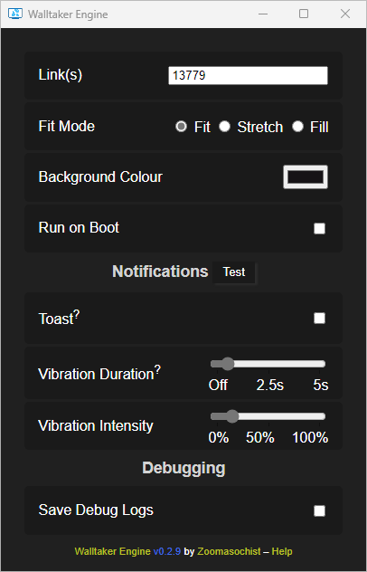

# Unmaintained

Windows 11 (I think) broke the method I was using to set video wallpapers and I don't really want to fix it.
Try [2wall2taker](https://github.com/dogkisser/2wall2taker) instead. No video support tho.



# Walltaker Engine

Free <https://walltaker.joi.how/> client with video support.

✅ Video support<br>
✅ Multi-monitor support<br>
✅ Instant changes<br>
✅ Subscribe to multiple links<br>
✅ Intiface support

## Building

**You don't need to do this.** [Click here](https://github.com/dogkisser/walltaker-engine/wiki/How%E2%80%90To)
for a how-to on running Walltaker Engine.

Walltaker Engine only builds on Windows.

```bash
$ cargo build --release
$ target/release/walltaker-engine.exe
```
