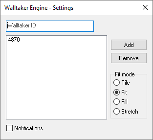

  

- 📬 **Immediate Updates**: Walltaker Engine updates your wallpaper as soon as 
    somebody changes it - no polling.
- 🖇 **Stay Connected**: Walltaker Engine can monitor multiple links at once.
- 🎦 **Vidya**: Walltaker Engine supports images and video wallpapers
    (with audio!)

# [Walltaker](https://walltaker.joi.how/) Engine

Like Wallpaper Engine but free, open source, and only for porn.

## Running

- Download and install the latest release from
    [here](https://github.com/zoomasochist/walltaker-engine/releases)
- Open Settings from the system tray, enter your Walltaker ID and slap "Add".
- Thats it!

## Issues

Due to the early phase of Walltaker Engine, you may encounter issues.
Please report them via Github Issues or Discord. Thx.

## Building

The only build dependency is pkg-config. LibVLC is vendored.